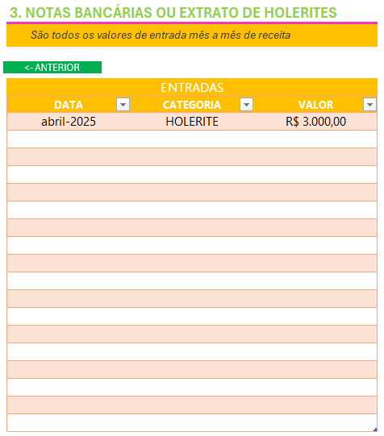
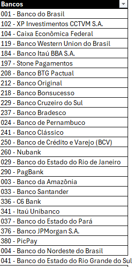

# 🧾 Organizador de Imposto de Renda - Excel

Este projeto foi desenvolvido como parte de um Desafio de Projeto da DIO, com o objetivo de criar uma solução prática e funcional, em Excel, para auxiliar no processo de organização e controle das informações utilizadas na declaração do Imposto de Renda Pessoa Física (IRPF).

---

## 🧠 Objetivo

Facilitar o preenchimento da declaração anual de IR por meio de um **agregador de dados** construído em Excel. A ferramenta reúne informações importantes sobre rendimentos, bens, despesas dedutíveis, entre outros, em um formato validado, acessível e visualmente amigável.

---

## 🛠️ Funcionalidades

- ✅ **Menu de navegação** com botões para acesso rápido às seções principais.
- 🧾 **Formulários de lançamento** com validação de dados e campos padronizados.
- 📋 **Resumo consolidado** para facilitar a conferência e cruzamento de dados.
- 🔍 **Validações automatizadas** para evitar erros comuns no preenchimento.
- 📊 Interface amigável com design funcional.

---

## 📷 Exemplos Visuais

### 🧭 Menu de Navegação

### 📝 Lançamentos e Categorias

### ✅ Validações e Automatizações

---

## 📂 Estrutura do Repositório

organizador-ir-excel/

├── README.md

├── ProjetoCompleto.xlsx

└── imagens/

├── menu-navegacao.png

├── lancamentos.png

├── validacoes.png

└── links-uteis.png

---

## 🧭 Como Usar

1. Baixe o arquivo `ProjetoCompleto.xlsx`.
2. Habilite macros, se necessário.
3. Utilize os botões de navegação para acessar cada área da planilha.
4. Preencha os dados conforme o tipo de rendimento, despesa ou bem.
5. Use o painel de resumo para verificar e ajustar suas informações.

---

## ⚙️ Requisitos

- Microsoft Excel (versão 2016 ou superior)
- Habilitação de edição e macros (caso necessário)
- Conhecimentos básicos sobre declaração de IR

---

## 📌 Benefícios da Ferramenta

- Redução de erros no preenchimento do IR
- Centralização de informações relevantes
- Facilidade para organizar comprovantes e dados ao longo do ano
- Otimização do tempo no momento da declaração oficial

---

## 👨‍💻 Desenvolvido por

[Maurício Barros]  
🔗 [github.com/opusvix](https://github.com/opusvix)

---

## 💡 Dica

Use esta ferramenta ao longo do ano, registrando cada nova movimentação importante. No momento da declaração, todas as informações estarão organizadas e prontas!
